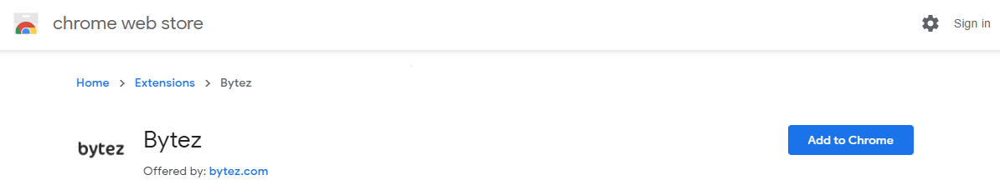
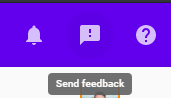
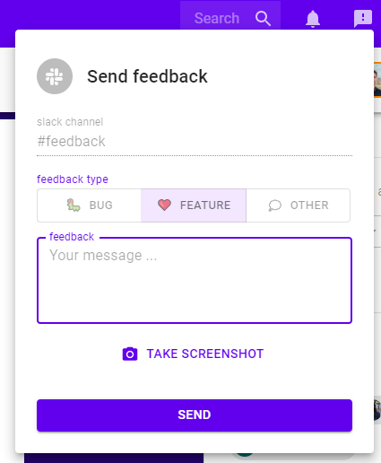

# Onboarding
Welcome to early access! Its so early, we're using a repo for onboarding 😂

Below, you'll find: 
* [What to Expect](#What-you-can-expect)
* [Features](#top-features)
* [How to Get Started](#Getting-started) 

## What you can expect
* Bytez will replace Adobe Reader when you open ML / data science papers from Arxiv.org
* At the moment, only Chrome / Chromium desktop browsers are supported
* If you open an ML paper that we havent seen yet, it may take us a few seconds to crawl the web for its content and convert it to HTML. Thereafter, that paper should load in less than 1 second. :)
* Please provide us feedback. We'll turn your ideas into features for the world to experience

#### Top Features
##### [Want to preview the features? Click here](https://bytez.com/read/arxiv/1706.03762/tour)

* Smart-reader
  * Papers have Wikipedia-style interactivity
  * Mark up papers with highlights and notes; share notes with your team
  * See each paper's code, content, and dicussions from around the web
* Save
  * Quick save papers to see them later
  * Save papers in private or team folders
* Search
  * Search for papers
  * Search for implemenations

## Getting started

### Step 1 - Install Chrome extension
[Install the Chrome extension](https://chrome.google.com/webstore/detail/bytez/bpmfhekkemkklhccdjkeokildopbneni)

### Step 2 - Pin the extension
Click Extensions, then find and pin the extension

### Step 3 - Share feedback
There's a feedback menu icon you can use to send us bugs, feature requests, or tell us a bad joke... :P

### Step 4 - Done
Now all Arxiv ML / data science papers will come to life in the Smart Reader. In case you want to go back to Adobe Reader, you can disable the plugin by clicking on it

